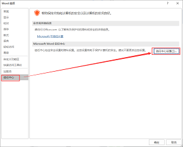

<h2>一、打开.doc、.docx、.xls、.xlsx、.ppt、.pptx等文档文件时出错</h2>

```
Word在试图打开文件时遇到错误。
请尝试下列方法：
*检查文档或驱动的文件权限。
确实有足够的内存和磁盘。
用文本恢复转换器打开文件。
（C:\Users\Administrator\...\word.doc）

参考：https://jingyan.baidu.com/article/dca1fa6f70df70f1a540525b.html
```


**方法一、解除文件锁定**


**方法二、word软件“受保护视图”问题**




